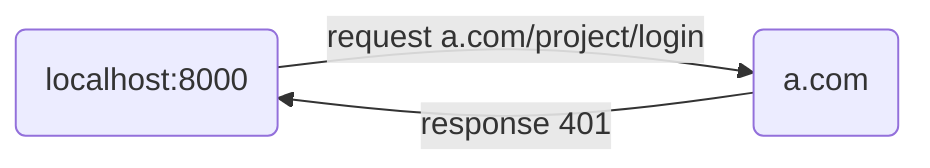
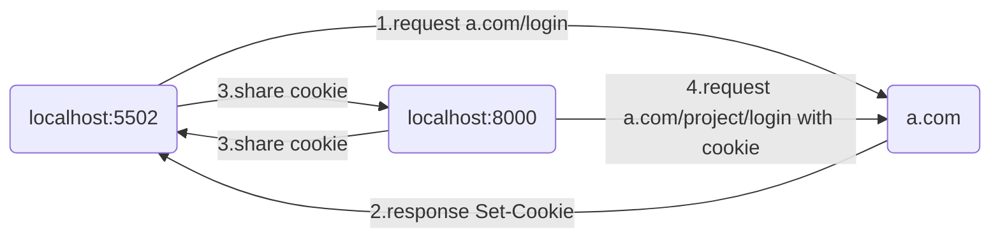

  上次刚说了csrf，并实现了个小案例去展示csrf的攻击流程。[用代码来看懂CSRF，再也不怕面试题记不住啦 - 掘金 (juejin.cn)](https://juejin.cn/post/7279056679562756096)
  
  这才刚过了五天就用上了，不过由于各种原因（偷懒）导致今天才有空来记录下。
  
  ## 场景
  前端项目中就是 vue 的 proxy ，然后假设 target 为 a.com ，本地开发环境则是localhost


到这里都还是比较正常的

### 问题1
在项目登录页面登录的时候，登录接口 a.com/project/login 竟然给我返回了 401。




你猜我为什么要登录

### 解决
后来了解了一下是因为一年总有那么几个月是需要另外登录的，于是我就去到了 a.com/login 页面进行了登录，登录了之后，在域名 a.com 下就有了一个 cookie ，当我登录接口 a.com/project/login 带上这个 cookie 后就不会返回 401 了。


## 问题2
根据我两年半开发经验和10年的八股文经验，我本地的开发环境是 localhost，a.com 的 cookie 怎么会乖乖帮我自动带上呢。

### 解决
打开浏览器控制台，把 a.com 的 cookie 复制到 locahost 的 cookie 上

## 问题3
移动端的项目真机调试怎么办，手机上可不能打开浏览器控制台呀。

### 完美解决
到这里，细心的朋友们已经发现了，我们刚刚是把 a.com 的 cookie 拿来使用了，并且请求的也是  a.com 的服务端，这不就是 csrf 嘛。





既然这样，我们掏出nginx：

```
server {
       listen       5502;
       server_name  localhost;

       location / {
            proxy_pass https://a.com;
       }

    }
```
然后我们通过 localhost:5502/login 去访问到 a.com/login 并登录，此时的 cookie 就会存到 localhost:5502下。

然后当我们回到我们的开发环境 localhost:8000 ，我们就能在此看到我们的 cookie 中有刚刚登录的缓存啦。自然 a.com/project/login 也不再给我返回 401 了。

### 过程中的成长
在配置nginx的代理时，一开始的想法是把本地的项目开发环境和 a.com 都代理到同一个端口号的。但是实践过后才发现，两个网站有相同的路由冲突，另外代理了两个网站，那么肯定是有一个网站的访问地址是要加路由层级 /project 的，这也会导致它里面的其他接口自动带上这个多出来的 /project 。对于这个问题最好的方案是把 a.com 代理到 /project ，然后我的开发环境代理到 /，因为a.com我只是想登录一下，我另外再代理它的登录接口就好了。但后续又发现了我的项目中一些接口因为这个代理又出现了另外的问题。
#### 最终的想法
最后的条件：不代理我的本地开发环境，只代理 a.com ，利用nginx，让它的cookie缓存到localhost:8000。

当时也查到了一个 proxy_cookie_domain 应该是可以帮我完成这个事情的，但我打算重新试一试的时候，去 localhost:8000 清除cookie的时候我竟然发现他这里已经有了 a.com 的 cookie缓存了。


由于我刚刚已经试过反向代理我的本地环境和 a.com 了，但是再 5502 端口上的，结合proxy_cookie_domain的名字我回想起 cookie 只有 domain 和 path ，并没有 port ，一个想法出现在了我的脑海，有没有可能 cookie 不受端口的限制。

---
经过试验后，正如我的推测，cookie 是不受 port 的限制的，也正因这个结论，才得出了我的最终解决方法：只代理 a.com 到与我本地开发环境相同的域名中即可。

#### 为什么会觉得 cookie 受限于端口
只能说自己学艺不精，从一开始了解cookie就并没有提到端口，都是 domain 域名，并且在控制台上是确确实实带有端口号的，如下图：

所以才会下意识的认为cookie是受限于端口号。


## 最后
总的来说问题已经解决了，并从中加深了对 cookie 的理解：cookie 并不受限于 port。更反映出自己学一个东西时的理解不够全面。。。。

希望以后能更好吧。


 


